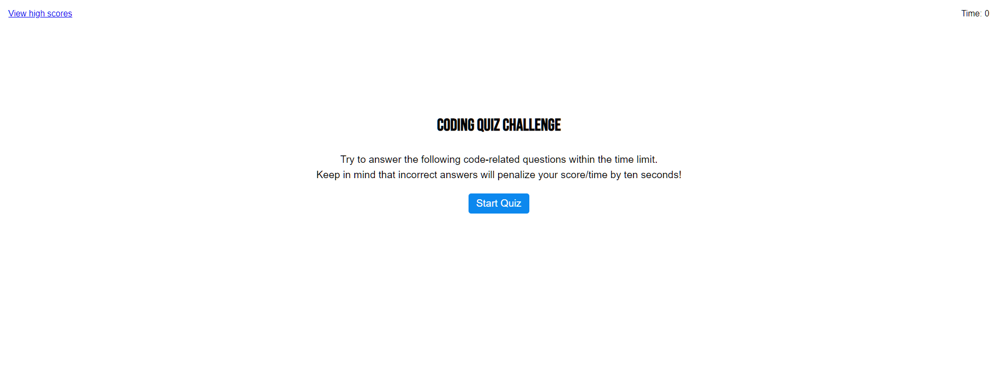
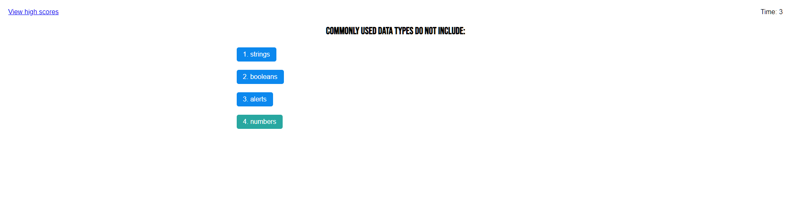

# 04-BC-Js-code-quiz
This repo was created for a website that holds a quiz with different questions regarding JavaScript knowledge

## Description

This web application is a JavaScript quiz that presents the user different questions that they have to respond, and if they choose the wrong one, time will be deducted from their time remaining and decreasing their score. When all of the questions have been asked or the time remaining reaches zero, the quiz ends and presents the user a submit form to store the highscores achieved. With the view highscores, the user is taken to another html file that stores all of the high scores.

## Mockup

The site should have the functionality described in the following image:

## Link

Follow this URL to access the website: https://alextrejo92.github.io/04-BC-Js-code-quiz/

## Installation

N/A

## Credits

The web page design was provided by EdX bootcamps & Tec de Monterrey. The functionality of the page was coded by me.

## License

Standar MIT license.